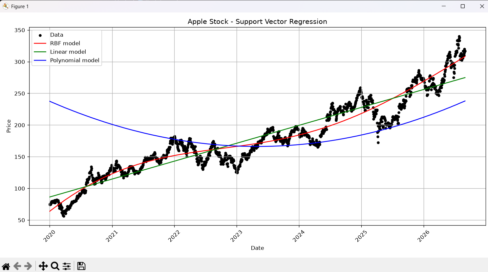

# Apple Stock Predictor

## What I've Learned
- I use support vector regression, which is a supervised ML algorithm that finds a decision boundary that fits within a specific margin of error and is used to predict continuous values (such as stock price)

- When using an SVR, we want to achieve two outcomes:
  1. A line with the largest minimum margin (i.e. Pick the line such that the distance between the line and the closest point is largest)
  2. A line that correctly separates as many instances as possible

- The penalty parameter `C = 1e3` controls how strongly the SVR model tries to fit the training data and therefore is used to determine the 2nd outcome

- I use 3 types of SVR:
  1. **Linear SVR:** Assumes the relationship is a straight line.
  2. **Polynomial SVR:** With `degree` of 2, assumes a quadratic relationship.
  3. **Radial Basis Function:** Lets the data determine the shape of the curve and the `gamma` parameter controls how far the influence of each training data point reaches.

## Results

**RBF (Red Line):**
- Captures the overall non-linear macro trend best among the three.
- However, it acts as a smooth trend line rather than a true short-term predictor.
- It completely ignores short-term volatility, market corrections (e.g., late 2022/2023 dip, early 2025 pullback), and rapid momentum bursts.

**Linear (Green Line):**
- Fits a simple straight-line upward trend across the entire dataset
- Stock prices are inherently non-linear over multiple years so it fails to adapt to periods of acceleration or deceleration in price growth.

**Polynomial (Blue Line):**
- Forms a U-shaped quadratic curve starting high (~$240 in 2020), bottoming out around 2023 (~$165), and curving back up toward 2026.
- The degree of 2 is improperly tuned for time-series regression
- E.g. It predicts that prices in early 2020 were higher than prices in 2022–2024, which directly contradicts the actual data points.

## Conclusions
The major limitation is that it uses the raw date as the sole input feature, which makes SVR a curve fitting tool rather than a predictive model.  It fits a trajectory over past dates but cannot forecast future market movements or react to structural shifts.

Improvements may include:
- Replace raw dates with lagged indicators (such as daily opening prices, moving averages, RSI, or volume)
- Instead of predicting absolute price level, predict log returns or or target stationary price differences.
- Adjust the degree and gamma parameters
- Split data strictly into past training and future test sets
